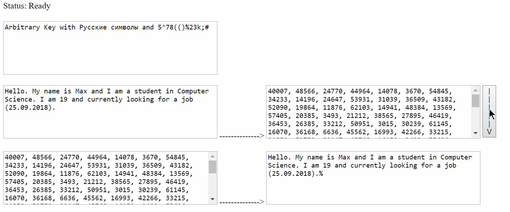

# JavaScript DES 
#### Minimalistic Javascript implementation of DES algorithm

This is a simple JS implementation of a symmetrical encryption algorithm DES with basic GUI and additional features like storing text and key in cookies.

* Web-site can be found [here](http://bekuzarov.cc.ua/DES/).

* Dependencies - jQuery only, included via CDN.
  
